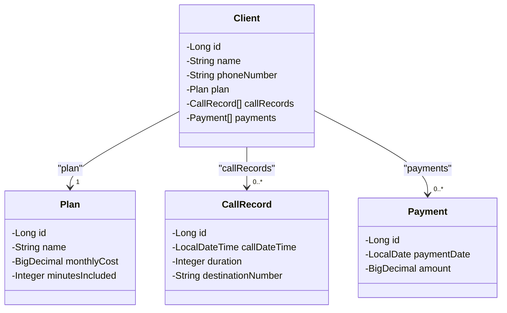

# Sistema de Gerenciamento de Clientes para Companhia Telefônica

Este projeto é uma API RESTful para gerenciar clientes de uma companhia telefônica, incluindo funcionalidades de criação, consulta, atualização e remoção (CRUD) de clientes, planos, registros de chamadas e pagamentos. 

A API permite que as operações sejam realizadas através de endpoints, facilitando o gerenciamento e controle dos dados de clientes e dos serviços prestados pela companhia.

## Funcionalidades

1. **Gerenciamento de Clientes**:
   - Adicionar novos clientes ao sistema.
   - Consultar informações de um cliente por ID.
   - Atualizar informações do cliente.
   - Remover clientes do sistema.

2. **Gerenciamento de Planos**:
   - Atribuir um plano a um cliente, incluindo dados como custo mensal e limite de dados.

3. **Registro de Chamadas**:
   - Armazenar e consultar registros de chamadas realizadas por cada cliente, incluindo o número de destino, duração e custo.

4. **Pagamentos**:
   - Registrar pagamentos feitos pelos clientes, especificando o valor e a data do pagamento.

## Diagrama de Classes

O diagrama abaixo ilustra a estrutura básica e as relações entre as classes principais do sistema:

## Tecnologias Utilizadas

- Java 21
- Spring Boot 3.3.5
- Spring Data JPA
- H2 Database
- Swagger
